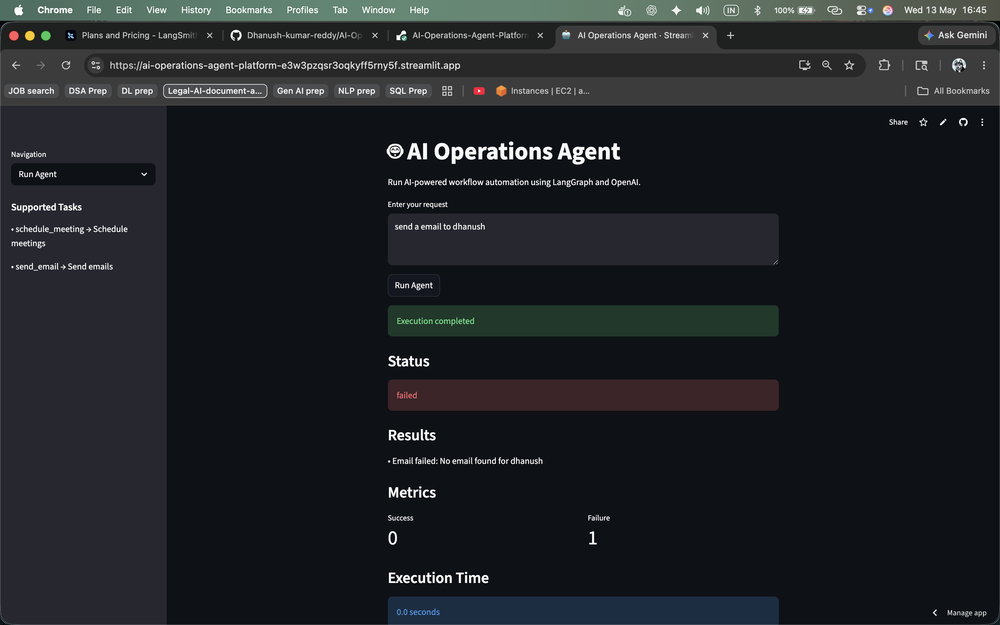
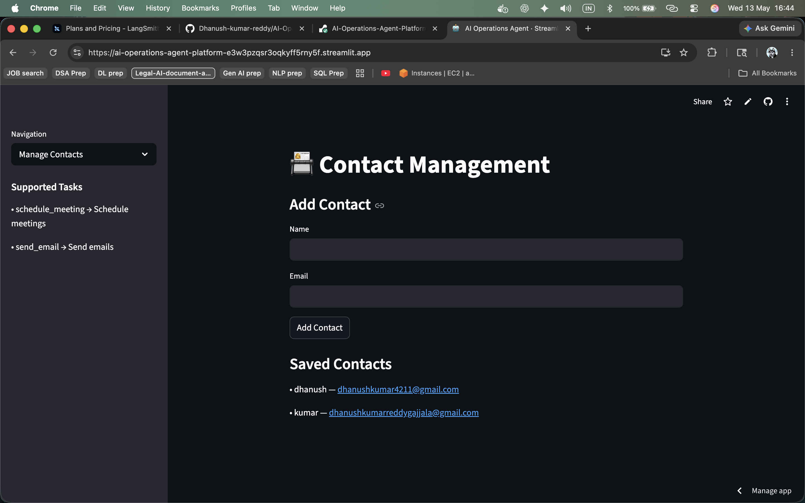
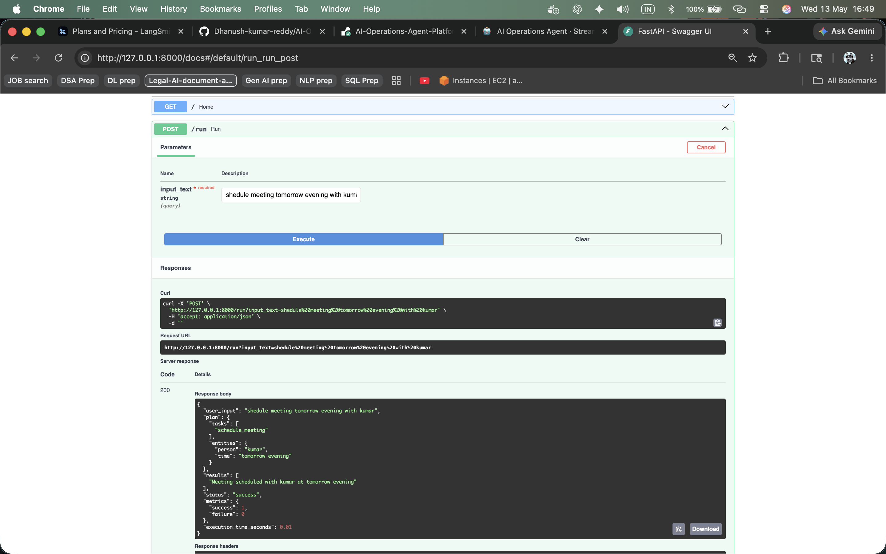
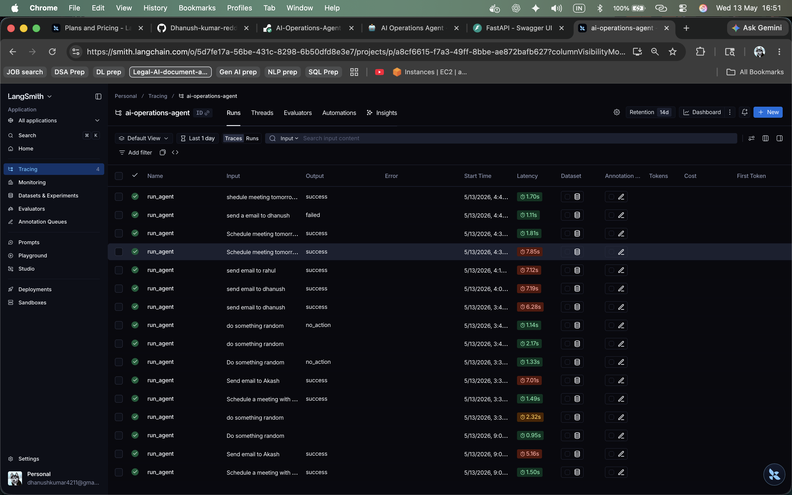

# AI Operations Agent

A production-style AI workflow orchestration platform built using LangGraph, FastAPI, OpenAI, Streamlit, SQLite, and LangSmith.

This system converts natural language requests into structured executable workflows and performs automated operations such as scheduling meetings and sending emails.

The project demonstrates AI workflow orchestration, backend engineering, observability, execution tracking, dynamic database-driven tooling, and production-style API architecture.

---

# Features

## AI Workflow Orchestration

- Natural language task planning using OpenAI
- LangGraph-based workflow orchestration
- Planner → Validator → Executor architecture
- Conditional routing and execution flow
- Structured task validation
- Retry and failure handling
- Dynamic tool execution system

---

## Backend Engineering

- FastAPI backend APIs
- SQLAlchemy ORM integration
- SQLite persistence layer
- Database-driven contact resolution
- Request audit trail/history
- Execution metrics and latency tracking
- Structured logging system
- Dynamic supported tasks API

---

## Frontend

- Streamlit-based interactive UI
- Contact management interface
- Sidebar-based navigation
- Supported task discovery
- Execution result visualization
- Metrics and execution time display

---

## Observability & Monitoring

- LangSmith tracing and observability
- Workflow execution logging
- Request history tracking
- Success/failure analytics

---

## Deployment

- Dockerized deployment setup
- GitHub-ready project structure

---

# Architecture

```text
User Input
    ↓
Streamlit UI / FastAPI API
    ↓
Planner (OpenAI)
    ↓
Validator
    ↓
LangGraph Workflow
    ↓
Executor
    ↓
Tool Execution Layer
    ↓
Database / Email Tools
    ↓
Structured Response
    ↓
Request History + Logging + LangSmith Tracing
```

---

# Tech Stack

## AI / Agent Frameworks

- OpenAI
- LangGraph
- LangSmith

---

## Backend

- FastAPI
- SQLAlchemy
- SQLite

---

## Frontend

- Streamlit

---

## Deployment

- Docker

---

## Utilities

- Python Dotenv
- Requests
- SMTP Email Automation

---

# Workflow

1. User enters a natural language request
2. Planner converts request into structured JSON
3. Validator filters unsupported tasks
4. LangGraph routes workflow execution
5. Executor dynamically triggers tools
6. Tools perform actions
7. Metrics, execution logs, and request history are stored
8. Results are returned to UI/API

---

# Supported Tasks

| Task | Description |
|---|---|
| schedule_meeting | Schedule meetings |
| send_email | Send emails |

---

# Example Request

```json
{
  "input": "Send email to Akash"
}
```

---

# Example Response

```json
{
  "user_input": "Send email to Akash",
  "plan": {
    "tasks": [
      "send_email"
    ],
    "entities": {
      "person": "Akash",
      "time": ""
    }
  },
  "results": [
    "Email sent to akash@gmail.com"
  ],
  "status": "success",
  "metrics": {
    "success": 1,
    "failure": 0
  },
  "execution_time_seconds": 4.27
}
```

---

# Project Structure

```text
ai-agent-system/
│
├── agent.py
├── planner.py
├── tools.py
├── models.py
├── logger.py
├── database.py
├── main.py
├── ui.py
├── seed_contacts.py
├── check_history.py
├── requirements.txt
├── Dockerfile
├── .dockerignore
├── .gitignore
├── logs.txt
├── agent.db
├── .env
├── screenshots/
└── README.md
```

---

# Setup

## Clone Repository

```bash
git clone <your_repo_url>
cd ai-agent-system
```

---

# Create Virtual Environment

## Mac/Linux

```bash
python -m venv venv
source venv/bin/activate
```

---

## Windows

```bash
python -m venv venv
venv\Scripts\activate
```

---

# Install Dependencies

```bash
pip install -r requirements.txt
```

---

# Environment Variables

Create a `.env` file:

```env
OPENAI_API_KEY=your_openai_key

EMAIL_USER=your_email@gmail.com
EMAIL_PASS=your_gmail_app_password

LANGCHAIN_API_KEY=your_langsmith_key
LANGCHAIN_TRACING_V2=true
LANGCHAIN_PROJECT=ai-operations-agent
```

---

# Run FastAPI Backend

```bash
uvicorn main:app --reload
```

Open Swagger UI:

```text
http://127.0.0.1:8000/docs
```

---

# Run Streamlit Frontend

```bash
streamlit run ui.py
```

---

# Database Setup

## Seed Initial Contacts

```bash
python seed_contacts.py
```

---

## Check Request History

```bash
python check_history.py
```

---

# Contact Management

The Streamlit UI includes a contact management system.

Users can:

- Add contacts dynamically
- View stored contacts
- Use contacts immediately in workflows

Example:

1. Add:
   - John → john@gmail.com

2. Run:
   - Send email to John

---

# API Endpoints

| Endpoint | Method | Description |
|---|---|---|
| / | GET | Health check |
| /run | POST | Run AI workflow |
| /tasks | GET | Get supported tasks |
| /contacts | GET | Fetch contacts |
| /contacts | POST | Add contact |
| /contacts/{id} | DELETE | Delete contact |

---

# Execution Tracking

The system tracks:

- Execution status
- Success/failure metrics
- Execution latency
- Request history
- Workflow logs
- LangSmith traces

---

# Docker

## Build Docker Image

```bash
docker build -t ai-agent .
```

---

## Run Docker Container

```bash
docker run -p 8000:8000 --env-file .env ai-agent
```

---

# Current Capabilities

- Schedule meetings
- Send emails
- Dynamic contact management
- Request history storage
- Workflow audit trails
- Retry failed executions
- Execution metrics tracking
- Execution latency monitoring
- LangSmith tracing
- Structured validation
- Dynamic task discovery
- Production-style API responses

---

# Key Engineering Concepts Demonstrated

- AI workflow orchestration
- LLM planning systems
- LangGraph state management
- Structured validation pipelines
- Retry and failure handling
- Dynamic tool routing
- Database-driven entity resolution
- Persistent audit trails
- Execution observability
- Production-style API design
- CRUD operations
- Full-stack AI application architecture

---

# Future Improvements

- Multi-agent workflows
- PostgreSQL migration
- Async task execution
- Role-based tool permissions
- Human approval workflows
- Vector memory / RAG integration
- Kubernetes deployment

---

# Screenshots

## Streamlit UI




---

## FastAPI Swagger Docs



---

## LangSmith Tracing



## Streamlit UI

```text
screenshots/ui.png
```

---

## FastAPI Swagger UI

```text
screenshots/swagger.png
```

---

## LangSmith Traces

```text
screenshots/langsmith.png
```

---

# Deployment Targets

- FastAPI Backend → Render
- Streamlit Frontend → Streamlit Community Cloud

---

# Author

Dhanush Kumar